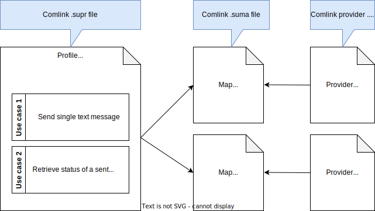

# How to integrate new API: Overview

This guide walks you through the process of creating a new API integration. You will learn how to setup the development environment, author the integration in Comlink language, integrate the API in your application, and run it in the production.

:::info

Before diving into the process of authoring the integration in Comlink language you should check [Superface Catalog](https://superface.ai/catalog) and search through existing use cases. If your use case already exists in [Superface Catalog](https://superface.ai/catalog) follow the [Getting started](../getting-started.mdx) guide.

:::

Superface created new domain-specific language called _Comlink_ for abstracting API integrations. Comlink language is designed to help developers create reusable, platform-agnostic API integrations.

Comlink language documents the integration for humans and describes the integration for machines to perform the API calls and understand API responses.

## Understand the Superface terms

First let's cover the terms you will deal with throughout this guide. The _Comlink_ language key concepts are _Profile_, _Use Case_, _Map_, and _Provider_.

Let's unpack this:

- [Profile](../reference/glossary.md#profile) is collection of _use cases_ that serves common cause. Profiles are files with `.supr` extension.
- [Use Case](../reference/glossary.md#use-case) represents a functionality that serves a business need.
- [Map](../reference/glossary.md#map) connects the _Use Case_ to a _Provider_. Maps are files with `.suma` extension.
- [Provider](../reference/glossary.md#provider) is a JSON file describing a set of host URLs, security schemes and integration parameters that fulfill use cases.

## What is your goal?

Depending on your needs, you can skip some parts of the guide to focus on your particular goal.

### I need a completely new use case

> I want to launch a spaceship but there is no use case for that in your catalog!

Adding a new use case is covered by the guide. Start with [Setup the development environment](/guides/setup-the-environment.md) and then follow the next chapters. Once the use case works for you, consider publishing it into the catalog so other users can use it in their projects and map it to other providers.

### I want to add a new provider for the existing use case

> I want to send emails with my favorite provider, but it's not in your catalog!

Ideally there is already a use case in the catalog which covers your need, but it cannot be performed with your preferred provider.

1. [Setup the development environment](./setup-the-environment.md)
2. [Add a new provider](./add-new-provider.md) if the provider doesn't exist yet (it may be used by another use case)
3. [Map use case to a provider](./map-use-case-to-provider.md)

### I have an issue with an existing use case

> I have tried a use case from the catalog, but it doesn't work!

> Your map is using the provider's API incorrectly!

Most of the use cases and providers maintained by Superface are located in the [Station GitHub repository](https://github.com/superfaceai/station). If you have any issues or suggestions regarding the existing capabilities, feel free to report an issue or send a pull request!
